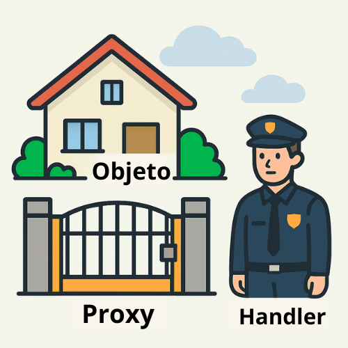

# Proxy

## Introdução ao Proxy em JavaScript

### O que é um Proxy?

Um Proxy em JavaScript é uma ferramenta que permite *vigiar e controlar o comportamento de um objeto*. Com ele, é possível interceptar ações como:

- Leitura de propriedades;
- Modificação de valores;
- Adição de novas chaves;


## Pra que serve?
- *Verificar dados antes de alterar*: Pode checar ou validar os dados antes de permitir uma modificação.
- *Criar registros automáticos*: Você pode automaticamente gravar ou mostrar mensagens sempre que alguém acessar ou modificar algo.
- *Alterar o comportamento do objeto*: Você pode fazer o objeto agir de maneira diferente dependendo da situação.
- *Modificar funções ou propriedades enquanto são usadas*: Permite mudar como as funções ou propriedades de um objeto funcionam quando alguém as chama.

## Como funciona?

1. **Objeto original**  
No projeto, temos objetos como `Pedido` e `Item`, que representam entidades principais. Por exemplo:

```javascript
const pedido = new Pedido(1, "Cliente A");
const item = new Item(1, "Produto X", 10.0, 2);
```

2. Criando o handler com as regras

```javascript
const pedidoProxy = new PedidoProxy(1, "Cliente A");
const itemProxy = new ItemProxy(1, "Produto X", 10.0, 2);
```

3. Criando o Proxy
```javascript
pedidoProxy.addItem(itemProxy.getItem()); // Proxy: Adicionando item ao pedido
const pedido = pedidoProxy.getPedido();  // Proxy: Retornando pedido
```

## O que é o handler?
O handler é o coração do Proxy. Ele define as regras do que deve acontecer quando algo for feito com o objeto.

### Analogia:
O objeto é uma casa 
O Proxy é o portão 
O handler são as regras do porteiro 

> [!NOTE]
> Sempre que alguém tenta acessar ou modificar algo, o porteiro (handler) verifica as regras e decide o que fazer.





## Participantes
Beatriz Vizeu N°1
Eloá Florêncio N°3
Laila Casadei N°15